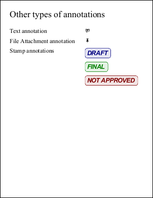

<h1>PDF Annotations</h1>
<h2>.NET project demonstrating how to create and manipulate PDF fields and annotations.</h2>

This code sample shows how to:

<ul>
<li>Generate a PDF document with fields created dynamically at run-time</li>
<li>Create fields including text boxes, radio buttons, checkboxes and signatures</li>
<li>Create signatures with appearances such as text or signature images</li>
<li>Set the values of fields and sign signatures in a variety of ways</li>
<li>Create markup annotations including squares, lines, text effects, circles and polygons</li>
<li>Generate a PDF document with movies inserted dynamically at run-time</li>
<li>Add other annotation types such as sticky notes, file attachments and rubber stamps</li>
</ul>

In the screenshots below you can see a variety of outputs from this project.

<em>The ABCpdf Team</em>

